# Buscador de Arquivos v3 — Análise Técnica e Plano de Implementação

> **Disciplina:** Algoritmos e Estruturas de Dados — FURB — Prof. Gilvan Justino
> **Documento:** Análise de Sistemas / Especificação Técnica (pré-implementação)
> **Autor da análise:** Analista Sênior de Sistemas
> **Data:** 03/06/2026 · **Prazo de entrega:** 09/06/2026 · **Correção:** 10/06/2026
> **Foco:** Backend em Java reutilizando as estruturas da disciplina · Frontend React mínimo (1 tela)

---

## Sumário

1. [Objetivo e contexto](#1-objetivo-e-contexto)
2. [Requisitos extraídos do enunciado](#2-requisitos-extraídos-do-enunciado)
3. [Inventário das estruturas reutilizáveis](#3-inventário-das-estruturas-reutilizáveis-repo-estrutura-de-dados)
4. [Decisão central: por que a busca é "instantânea"](#4-decisão-central-por-que-a-busca-é-instantânea)
5. [Arquitetura da solução](#5-arquitetura-da-solução)
6. [Modelo de dados e índice invertido](#6-modelo-de-dados-e-índice-invertido)
7. [Diagrama UML](#7-diagrama-uml)
8. [Especificação dos componentes (backend)](#8-especificação-dos-componentes-backend)
9. [Contrato da API HTTP](#9-contrato-da-api-http)
10. [Frontend React mínimo](#10-frontend-react-mínimo)
11. [Persistência do índice em disco](#11-persistência-do-índice-em-disco)
12. [Alterações nas estruturas reutilizadas](#12-alterações-nas-estruturas-reutilizadas-permitidas-pelo-enunciado)
13. [Matriz de rastreabilidade requisito → solução](#13-matriz-de-rastreabilidade-requisito--solução)
14. [Plano de implementação passo a passo](#14-plano-de-implementação-passo-a-passo)
15. [Riscos e mitigações](#15-riscos-e-mitigações)
16. [Análise de complexidade](#16-análise-de-complexidade)
17. [Pontos a confirmar com o professor](#17-pontos-a-confirmar-com-o-professor)
18. [Nível de confiabilidade](#18-nível-de-confiabilidade-da-análise)

---

## 1. Objetivo e contexto

Construir uma aplicação que **indexa palavras de arquivos `.txt`** (de um diretório e seus subdiretórios) usando um **mapa de dispersão (hash)** como índice invertido, de modo que a **busca por palavra(s) seja praticamente instantânea**. O índice é **persistido em disco** e recarregado na inicialização, sem reindexar.

O projeto começa **do zero** (o repositório de destino está vazio). A restrição central é: **não usar coleções nativas do Java** (`ArrayList`, `HashMap`, etc.) — devemos reutilizar as estruturas implementadas na disciplina, podendo **adicionar** métodos/atributos.

**O foco de avaliação é o backend Java** (matéria de estrutura de dados). O frontend React existe apenas como vitrine de visualização (uma única tela).

---

## 2. Requisitos extraídos do enunciado

### 2.1 Requisitos funcionais (RF)

| ID | Requisito | Detalhe |
|----|-----------|---------|
| RF01 | Definir diretório a indexar | Considerar **todos os `.txt`** do diretório **e subdiretórios** (varredura recursiva) |
| RF02 | Extrair palavras de cada arquivo | Aplicando as 4 regras de normalização (RF03–RF06) |
| RF03 | Case-insensitive | Sem distinção maiúscula/minúscula → normalizar para minúsculas |
| RF04 | Ignorar tokens só de dígitos/pontos | Palavras formadas **somente** por algarismos ou pontos **não** entram no índice |
| RF05 | Tamanho mínimo | Apenas palavras com **3 ou mais letras** |
| RF06 | Desprezar pontuação | Pontuações não fazem parte das palavras |
| RF07 | Índice = mapa de dispersão | Cada **palavra → lista de documentos** em que ela aparece |
| RF08 | Persistir índice em disco | Após indexar, salvar; busca ocorre **só em memória** |
| RF09 | Carregar índice do disco | Ao reiniciar, **carregar** sem reindexar |
| RF10 | Busca de 1 palavra | Exibir documentos que contêm a palavra |
| RF11 | Busca de N palavras (AND) | Exibir **apenas** documentos que contêm **todas** as palavras (interseção) |

### 2.2 Requisitos não funcionais / restrições (RN)

| ID | Restrição |
|----|-----------|
| RN01 | **Proibido** usar estruturas de dados nativas do Java (`ArrayList`, `HashMap`, `LinkedList`, `HashSet`...) |
| RN02 | **Obrigatório** reutilizar as estruturas implementadas na disciplina (permitido **adicionar** métodos/atributos) |
| RN03 | Busca deve ser **rápida e eficiente** (instantânea) → mapa de dispersão |
| RN04 | Entregar **Diagrama UML** + **código-fonte** |
| RN05 | Equipe de até 2 pessoas |

> **Interpretação de RN01:** a restrição é sobre **estruturas de dados** (containers de coleção). Classes utilitárias de **I/O e rede** (`java.io.File`, `BufferedReader`, `com.sun.net.httpserver.HttpServer`), `String`, `String[]` e tipos primitivos **são permitidos** — não são "estruturas de dados" no sentido da disciplina. O armazenamento do índice e das listas de resultado **deve** usar `MapaDispersao` e `ListaEncadeada` nossas.

---

## 3. Inventário das estruturas reutilizáveis (repo `estrutura-de-dados`)

Levantamento feito diretamente no código-fonte de `C:\Berkan\...\estrutura-de-dados\src`:

| Estrutura | Caminho original | Reutilização no projeto |
|-----------|------------------|--------------------------|
| **`MapaDispersao<K,T>`** | `UNI3/aula2/MapaDispersao.java` | ⭐ **Núcleo** — índice invertido (palavra → documentos) |
| **`NoMapa<K,T>`** | `UNI3/aula2/NoMapa.java` | Nó do mapa (par chave/valor genérico) |
| **`ListaEncadeada<T>`** | `UNI1/aula3/ListaEncadeada.java` | ⭐ Buckets do mapa, listas de documentos e de resultados |
| **`NoLista<T>`** | `UNI1/aula3/NoLista.java` | Nó da lista encadeada |
| `Fila` / `FilaLista<T>` | `UNI1/aula6/...` | *Opcional* — varredura iterativa (BFS) de subdiretórios |
| `ArvoreBinaria`, `ListaDupla`, `Pilha` | `UNI1`, `UNI2` | Não necessários para o escopo |

### 3.1 `MapaDispersao<K,T>` — a peça central (já é genérica!)

A versão da **aula 2** é exatamente o que precisamos: **chave genérica** (`String` = palavra) e **valor genérico** (`T` = lista de documentos). Métodos disponíveis:

```java
MapaDispersao(int tamanho)            // cria vetor de N buckets (ListaEncadeada vazias)
int    calcularHash(K chave)          // Math.abs(chave.hashCode()) % tamanho
void   inserir(K chave, T valor)      // insere NoMapa no bucket (SEM checar duplicata!)
T      buscar(K chave)                // O(1) médio → retorna valor ou null
void   remover(K chave)
double calcularFatorCarga()           // total de elementos / nº de buckets
```

Endereçamento por **encadeamento separado** (cada bucket é uma `ListaEncadeada`). Colisões viram listas; com fator de carga baixo, as listas ficam curtas → **busca O(1) na média**.

### 3.2 `ListaEncadeada<T>` (UNI1/aula3) — base de tudo

```java
NoLista<T> getPrimeiro()
boolean    estaVazia()
NoLista<T> buscar(T valor)            // compara por .equals()
void       retirar(T valor)
void       inserir(T valor)           // insere no INÍCIO (head)
NoLista<T> obterNo(int idx)
int        obterComprimento()
String     toString()
```

> ⚠️ **Atenção:** existe uma **segunda** `ListaEncadeada` em `UNI1/aula6/exercicio3_4` que tem `inserirNoFinal(...)`. A `MapaDispersao` importa a de **`UNI1/aula3`** (insere no início). Usaremos a de **aula3** como canônica. Ordem de inserção dos documentos numa palavra **não importa** para a busca AND.

---

## 4. Decisão central: por que a busca é "instantânea"

> **Pergunta do enunciado/cliente:** *qual estrutura torna a busca instantânea?*
> **Resposta:** o **`MapaDispersao` (tabela hash) usado como índice invertido**.

### Raciocínio

- **Sem índice (força bruta):** buscar uma palavra exigiria reabrir e varrer todos os arquivos a cada consulta → **O(total de palavras em todos os documentos)**. Inviável "ao vivo".
- **Com índice invertido em hash:** a busca vira `indice.buscar(palavra)`, que calcula `hashCode` da palavra e vai direto ao bucket → **O(1) na média** (mais o tamanho da lista de colisão, mantida curta pelo fator de carga). A consulta **independe** do tamanho do acervo.

### Como garantir o O(1) na prática

1. **Vetor de buckets grande o suficiente** para manter o **fator de carga baixo** (≈ 1.0). Vocabulário típico de textos: milhares a dezenas de milhares de palavras distintas.
   - Recomendação: tamanho **primo** generoso, ex.: `100003` (ou dimensionar pelo nº esperado de palavras distintas). Número primo distribui melhor o resto da divisão.
2. **Função de hash** delegando ao `String.hashCode()` (boa dispersão para texto).
3. **Busca AND** começa pela **menor** lista de documentos (poda cedo).

A "sensação" de instantâneo no frontend é reforçada por **debounce** no campo de busca, mas o que realmente entrega a velocidade é o hash no backend.

---

## 5. Arquitetura da solução

Decisão de integração (aprovada): **`com.sun.net.httpserver.HttpServer` embutido no JDK** — zero dependências externas, mantém a convenção "Java puro" do repositório e não fere RN01.

```
┌──────────────────────────────┐         HTTP (JSON)        ┌───────────────────────────────────────────┐
│   Frontend React (1 tela)    │  ───────────────────────▶  │            Backend Java (JDK puro)          │
│  Vite · porta 5173           │                            │            com.sun.net.httpserver · :8080   │
│                              │  ◀───────────────────────  │                                             │
│  • Campo diretório + Indexar │      JSON montado à mão    │  ┌─────────────┐  ┌──────────────────────┐  │
│  • Campo busca (debounce)    │                            │  │ ServidorHttp│─▶│ Indexador / MotorBusca│  │
│  • Lista de resultados       │                            │  └─────────────┘  └─────────┬────────────┘  │
└──────────────────────────────┘                            │                             ▼               │
                                                            │                   ┌────────────────────┐    │
                                                            │                   │  IndiceInvertido    │    │
                                                            │                   │  (MapaDispersao)    │    │
                                                            │                   └─────────┬──────────┘    │
                                                            │                             ▼               │
                                                            │                   ┌────────────────────┐    │
                                                            │                   │ RepositorioIndice   │    │
                                                            │                   │ (salva/carrega .idx)│    │
                                                            │                   └─────────┬──────────┘    │
                                                            └─────────────────────────────┼───────────────┘
                                                                                          ▼
                                                                                  💾 indice.idx + documentos.idx
```

### 5.1 Camadas (backend)

| Camada | Responsabilidade | Classes |
|--------|------------------|---------|
| **Estruturas** | Estruturas de dados da disciplina (reutilizadas) | `MapaDispersao`, `NoMapa`, `ListaEncadeada`, `NoLista` |
| **Domínio** | Modelo do problema | `Documento` |
| **Índice** | Construir/normalizar/persistir o índice | `ExtratorPalavras`, `Indexador`, `IndiceInvertido`, `RepositorioIndice` |
| **Busca** | Consulta de 1 ou N palavras (AND) | `MotorBusca` |
| **API** | Expor HTTP + serializar JSON | `ServidorHttp`, `JsonUtil` |
| **App** | Ponto de entrada (`main`) | `App` |

### 5.2 Estrutura de pastas proposta (projeto novo)

```
trabalho-final-algoritimo-estrutura-dados/
├── README.md
├── docs/
│   ├── ANALISE-E-PLANO.md          ← este documento
│   ├── API.md                       ← contrato HTTP (extraível desta análise)
│   └── uml/                         ← diagrama UML (imagem/PlantUML)
├── backend/
│   ├── .vscode/settings.json        ← sourcePath=src, outputPath=bin, lib/**/*.jar
│   ├── lib/
│   │   └── junit-platform-console-standalone-6.0.0-RC2.jar
│   ├── src/
│   │   ├── estruturas/              ← cópia reempacotada das estruturas da disciplina
│   │   │   ├── ListaEncadeada.java
│   │   │   ├── NoLista.java
│   │   │   ├── MapaDispersao.java
│   │   │   └── NoMapa.java
│   │   ├── dominio/
│   │   │   └── Documento.java
│   │   ├── indice/
│   │   │   ├── ExtratorPalavras.java
│   │   │   ├── IndiceInvertido.java
│   │   │   ├── Indexador.java
│   │   │   └── RepositorioIndice.java
│   │   ├── busca/
│   │   │   └── MotorBusca.java
│   │   ├── api/
│   │   │   ├── ServidorHttp.java
│   │   │   └── JsonUtil.java
│   │   └── App.java
│   └── test/                        ← testes JUnit (espelham src)
└── frontend/
    └── (app Vite + React — 1 tela)
```

> **Reempacotamento:** as estruturas originais têm `package UNI1.aula3;` / `package UNI3.aula2;`. Ao copiá-las para o novo projeto, trocaremos a declaração de `package` para `estruturas;` e ajustaremos os `import`. Isso **mantém a mesma implementação** (atende RN02 — "reutilizar") e organiza o projeto. É um ponto de atenção de compilação (ver §15).

---

## 6. Modelo de dados e índice invertido

### 6.1 Estrutura do índice (recomendada)

Usaremos **dois mapas** + um identificador inteiro por documento. Isso deixa as listas de palavras compactas (guardam `Integer` em vez de repetir caminhos longos) e a persistência menor.

```
IndiceInvertido
 ├── palavras : MapaDispersao<String, ListaEncadeada<Integer>>   // palavra → IDs de documentos
 └── documentos : MapaDispersao<Integer, Documento>               // ID → Documento (id, caminho)
                  (+ contador de IDs e uma lista de todos os documentos para varrer na persistência)
```

- **`palavras`**: chave = palavra normalizada; valor = `ListaEncadeada<Integer>` com os IDs dos documentos que a contêm (sem repetição).
- **`documentos`**: chave = ID (`Integer`); valor = `Documento { int id; String caminho; }`.

> **Variante mais simples (fallback):** `MapaDispersao<String, ListaEncadeada<String>>` (palavra → caminhos diretos). Menos classes, porém repete strings de caminho e a interseção compara `String`. Recomendo a versão com IDs por ser mais limpa e didática (usa **duas** estruturas, valoriza a nota), mas a fallback atende 100% dos requisitos se o tempo apertar.

### 6.2 Inserção no índice — **cuidado crítico**

`MapaDispersao.inserir(chave, valor)` **sempre cria um novo nó** — ele **não** verifica se a chave já existe nem atualiza. Se chamarmos `inserir("casa", ...)` duas vezes, ficam **duas** entradas "casa" no bucket, e `buscar` só acha a primeira. **Erro silencioso clássico.**

**Padrão correto** ao indexar uma ocorrência (palavra `p` no documento `id`), reutilizando só métodos existentes:

```
lista = palavras.buscar(p)                 // já existe a palavra?
se lista == null:                          // primeira vez que vemos 'p'
    lista = new ListaEncadeada<Integer>()
    palavras.inserir(p, lista)             // insere a CHAVE uma única vez
se lista.buscar(id) == null:               // doc ainda não registrado p/ essa palavra?
    lista.inserir(id)                      // adiciona o ID
```

Como `lista` é o **mesmo objeto** referenciado dentro do mapa, mutá-la atualiza o índice sem precisar re-inserir a chave. **Sempre `buscar` antes de `inserir` chave nova.**

---

## 7. Diagrama UML

Diagrama de classes (renderizável em qualquer visualizador Mermaid; converter para imagem na entrega):

```mermaid
classDiagram
    direction LR

    class NoLista~T~ {
        -T info
        -NoLista~T~ proximo
        +getInfo() T
        +setInfo(T)
        +getProximo() NoLista~T~
        +setProximo(NoLista~T~)
    }

    class ListaEncadeada~T~ {
        -NoLista~T~ primeiro
        +inserir(T)
        +buscar(T) NoLista~T~
        +retirar(T)
        +obterComprimento() int
        +estaVazia() boolean
        +getPrimeiro() NoLista~T~
    }

    class NoMapa~K,T~ {
        -K chave
        -T valor
        +getChave() K
        +getValor() T
        +equals(Object) boolean
        +hashCode() int
    }

    class MapaDispersao~K,T~ {
        -ListaEncadeada~NoMapa~ info[]
        +calcularHash(K) int
        +inserir(K, T)
        +buscar(K) T
        +remover(K)
        +calcularFatorCarga() double
        +obterTodosNos() ListaEncadeada~NoMapa~  «novo»
        +obterTamanho() int «novo»
    }

    class Documento {
        -int id
        -String caminho
        +getId() int
        +getCaminho() String
    }

    class ExtratorPalavras {
        +extrair(String linha) ListaEncadeada~String~
        +ehValida(String token) boolean
    }

    class IndiceInvertido {
        -MapaDispersao~String, ListaEncadeada~ palavras
        -MapaDispersao~Integer, Documento~ documentos
        +adicionarOcorrencia(String, int)
        +registrarDocumento(String) int
        +buscarUma(String) ListaEncadeada~Integer~
        +buscarTodas(ListaEncadeada~String~) ListaEncadeada~Documento~
    }

    class Indexador {
        +indexar(String diretorio) IndiceInvertido
        -varrerDiretorio(File, IndiceInvertido)
        -indexarArquivo(File, IndiceInvertido)
    }

    class RepositorioIndice {
        +salvar(IndiceInvertido, String caminho)
        +carregar(String caminho) IndiceInvertido
    }

    class MotorBusca {
        -IndiceInvertido indice
        +pesquisar(String consulta) ListaEncadeada~Documento~
    }

    class ServidorHttp {
        +iniciar(int porta)
        -handleIndexar()
        -handleBuscar()
        -handleStatus()
    }

    class App {
        +main(String[])
    }

    ListaEncadeada --> NoLista
    MapaDispersao --> NoMapa
    MapaDispersao --> ListaEncadeada
    IndiceInvertido --> MapaDispersao
    IndiceInvertido --> Documento
    Indexador --> IndiceInvertido
    Indexador --> ExtratorPalavras
    RepositorioIndice --> IndiceInvertido
    MotorBusca --> IndiceInvertido
    ServidorHttp --> Indexador
    ServidorHttp --> MotorBusca
    ServidorHttp --> RepositorioIndice
    App --> ServidorHttp
```



---

## 8. Especificação dos componentes (backend)

### 8.1 `ExtratorPalavras` — normalização (RF02–RF06)

Responsável por transformar uma linha de texto em **tokens válidos**.

**Algoritmo recomendado — varredura por "corridas de letras":**
percorre a `String` caractere a caractere; acumula sequências de **letras** (`Character.isLetter(c)` — aceita acentos do português: á, ç, ã, é...). Qualquer caractere que **não** é letra (espaço, pontuação, **dígito**, ponto) atua como **separador**. Ao fechar um token:

1. `token = token.toLowerCase(java.util.Locale.ROOT)` → **RF03** (case-insensitive).
2. Como o token é composto **só de letras**, dígitos e pontuação já foram descartados → **RF04 + RF06** automaticamente.
3. Se `token.length() >= 3`, é válido → **RF05**.

Esse algoritmo satisfaz as 4 regras simultaneamente e sem ambiguidade sobre "só dígitos/pontos" (eles nunca formam token).

> **Decisão de design a confirmar (ver §17):** com essa abordagem, um token misto como `casa2` é separado em `casa`. A alternativa (quebrar só em espaços/pontuação e depois descartar tokens 100% numéricos) manteria `casa2` inteiro e o descartaria por conter dígito apenas se for **só** dígito. A leitura literal do enunciado ("apenas palavras **com 3 ou mais letras**", "constituídas **somente** por algarismos ou pontos não devem ser indexadas") favorece a abordagem por corridas de letras. **Recomendo essa**; deixo registrado para validação.

Retorna `ListaEncadeada<String>` (nossa estrutura, não `List` nativa).

**Encoding:** ler arquivos como **UTF-8** explicitamente (`InputStreamReader(new FileInputStream(f), StandardCharsets.UTF_8)`) para não corromper acentos.

### 8.2 `Indexador` — varredura e construção (RF01, RF07)

- `indexar(String diretorio)`:
  1. Cria `IndiceInvertido` vazio (mapas dimensionados — ver §16).
  2. Varre **recursivamente** o diretório com `java.io.File.listFiles()`; para cada subpasta, desce; para cada arquivo terminando em `.txt` (case-insensitive), chama `indexarArquivo`.
     - *Opcional didático:* trocar a recursão por **BFS iterativo** usando a nossa `Fila`/`FilaLista` — mostra mais uma estrutura. Recursão é mais simples e suficiente.
  3. `indexarArquivo`: registra o documento (gera ID), lê linha a linha, chama `ExtratorPalavras.extrair`, e para cada token chama `IndiceInvertido.adicionarOcorrencia(token, id)`.
- Retorna o `IndiceInvertido` pronto.

### 8.3 `IndiceInvertido` — o índice em si (RF07)

- `registrarDocumento(String caminho) -> int id`: incrementa contador, cria `Documento`, insere no mapa `documentos` e numa `ListaEncadeada<Documento>` auxiliar (para varrer na persistência).
- `adicionarOcorrencia(String palavra, int id)`: aplica o **padrão buscar-antes-de-inserir** da §6.2.
- `buscarUma(String palavra) -> ListaEncadeada<Integer>`: `palavras.buscar(palavra)` (já normalizar a palavra antes).
- `buscarTodas(ListaEncadeada<String> consulta) -> ListaEncadeada<Documento>`: interseção AND (ver §8.4).

### 8.4 `MotorBusca` — consulta 1 ou N palavras (RF10, RF11)

```
pesquisar(consultaTexto):
    termos = ExtratorPalavras.extrair(consultaTexto)   // normaliza a query igual ao índice
    se termos vazio: retorna lista vazia

    // pega a lista de IDs do 1º termo
    resultado = indice.buscarUma(termos[0])
    se resultado == null: retorna lista vazia          // termo inexistente → AND falha

    // interseção com os demais termos
    para cada termo restante t:
        listaT = indice.buscarUma(t)
        se listaT == null: retorna lista vazia
        resultado = interseccao(resultado, listaT)     // mantém só IDs presentes em ambas
        se resultado vazio: retorna lista vazia         // poda

    // resolve IDs → Documentos
    retorna mapearIdsParaDocumentos(resultado)
```

- `interseccao(a, b)`: percorre `a`; para cada `id`, se `b.buscar(id) != null`, adiciona ao resultado. Tudo com `ListaEncadeada`.
- **Otimização** (opcional): ordenar os termos pela **menor** lista primeiro reduz o trabalho.
- Busca de **1 palavra** é o caso degenerado (loop de interseção não executa).

### 8.5 `App` — `main`

1. Define caminho do arquivo de índice (`./dados/indice.idx`).
2. Se existir índice salvo → `RepositorioIndice.carregar` (**RF09**, sem reindexar).
3. Sobe `ServidorHttp` na porta 8080.
4. Indexação é disparada **sob demanda** pelo endpoint `/api/indexar` (ou via argumento de linha de comando).

---

## 9. Contrato da API HTTP

Servidor `com.sun.net.httpserver.HttpServer` na porta **8080**. Respostas JSON montadas à mão por `JsonUtil` (sem Jackson/Gson). **Todos** os handlers enviam cabeçalhos CORS para o dev server do React.

```
Access-Control-Allow-Origin: *
Access-Control-Allow-Methods: GET, POST, OPTIONS
Access-Control-Allow-Headers: Content-Type
Content-Type: application/json; charset=utf-8
```

### POST `/api/indexar`
Indexa um diretório e persiste o índice.
```jsonc
// request
{ "diretorio": "C:\\meus-textos" }
// response 200
{ "ok": true, "documentos": 42, "palavras": 13987, "fatorCarga": 0.14, "tempoMs": 318 }
```

### GET `/api/buscar?q=palavra1 palavra2`
Busca AND. `q` é URL-encoded.
```jsonc
// response 200
{
  "consulta": ["palavra1", "palavra2"],
  "totalDocumentos": 2,
  "documentos": [
    { "id": 7,  "caminho": "C:\\meus-textos\\sub\\a.txt" },
    { "id": 19, "caminho": "C:\\meus-textos\\b.txt" }
  ]
}
```

### GET `/api/status`
```jsonc
{ "indiceCarregado": true, "documentos": 42, "palavras": 13987, "fatorCarga": 0.14 }
```

> ⚠️ **Escape de JSON em caminhos do Windows:** caminhos têm `\` (ex.: `C:\textos\a.txt`). No JSON cada `\` vira `\\`. `JsonUtil.escape()` **deve** escapar `\`, `"`, e caracteres de controle. Falha aqui gera JSON inválido que o React não consegue parsear. **Risco mapeado** (§15).

---

## 10. Frontend React mínimo

Stack: **Vite + React** (Node v22 já instalado). **Uma única tela**, sem router, sem libs de estado.

Passo a passo de criação:
```bash
cd frontend
npm create vite@latest . -- --template react
npm install
npm run dev      # http://localhost:5173
```

A tela (`App.jsx`) tem:
1. **Bloco Indexação:** input "Diretório" + botão **Indexar** → `POST /api/indexar`. Mostra retorno (nº de docs/palavras, tempo).
2. **Bloco Busca:** input de texto com **debounce (~250 ms)** → `GET /api/buscar?q=...`. Renderiza a lista de caminhos retornada. O debounce dá a sensação "instantânea" sem disparar requisição a cada tecla.
3. **Status:** chamada inicial a `/api/status` para mostrar se há índice carregado.

> O React **não** implementa estrutura de dados — apenas chama a API e renderiza. Todo o peso algorítmico (e a avaliação) está no backend. Não usar bibliotecas extras além do template padrão.

---

## 11. Persistência do índice em disco

**Formato recomendado: texto UTF-8 em 2 arquivos** (legível, inspecionável, sem acoplar `Serializable`, e — importante — **evita a tentação de coleções nativas** na (de)serialização).

### `documentos.idx`
```
# tamanhoMapaPalavras=100003   ← cabeçalho com parâmetros p/ reconstruir fielmente
0\tC:\textos\a.txt
1\tC:\textos\sub\b.txt
...
```

### `indice.idx`
```
palavra\tid1,id2,id3
casa\t0,1,5
janela\t1
...
```

- **Salvar:** usar `MapaDispersao.obterTodosNos()` (método novo, §12) para varrer todas as entradas de `palavras` e escrever linha a linha; varrer a lista de `documentos` para o outro arquivo. `BufferedWriter` com UTF-8.
- **Carregar:** ler o cabeçalho (tamanho do mapa), recriar `IndiceInvertido`, reconstruir `documentos` e depois `palavras` (para cada linha, `split('\t')`, `split(',')`, `inserir`). Reconstrói **sem reindexar arquivos** → **RF09**.
- **Atenção:** separador `\t` exige que caminhos não contenham TAB (verdadeiro no Windows). Escapar/validar se necessário.

> **Alternativa:** `ObjectOutputStream`/`ObjectInputStream` com as estruturas implementando `Serializable`. Funciona, mas é menos transparente para demonstração e exige cuidado com `serialVersionUID`. **Recomendo o formato texto** pela clareza didática.

---

## 12. Alterações nas estruturas reutilizadas (permitidas pelo enunciado)

RN02 permite **adicionar** métodos/atributos. Mudanças **mínimas** previstas:

| Classe | Adição | Motivo |
|--------|--------|--------|
| `MapaDispersao` | `ListaEncadeada<NoMapa<K,T>> obterTodosNos()` | Varrer todas as entradas para **persistir** o índice (hoje os buckets são privados e não há iteração) |
| `MapaDispersao` | `int obterTamanho()` | Salvar o tamanho do vetor no cabeçalho (recriar fiel) |
| `MapaDispersao` | *(opcional)* blindar `calcularHash` | `Math.abs(Integer.MIN_VALUE)` é negativo → índice negativo. Trocar por `(chave.hashCode() & 0x7fffffff) % info.length` elimina o caso de borda |
| `NoLista`/`ListaEncadeada` | nenhuma obrigatória | Métodos atuais bastam |

Nenhuma alteração quebra o comportamento existente; são **acréscimos**. Documentar cada um como "método complementar".

---

## 13. Matriz de rastreabilidade requisito → solução

| Req | Atendido por | Verificação |
|-----|--------------|-------------|
| RF01 | `Indexador.varrerDiretorio` (recursivo, filtro `.txt`) | Teste com subpastas |
| RF02–RF06 | `ExtratorPalavras` (corridas de letras + lowercase + len≥3) | Testes unitários de tokenização |
| RF07 | `IndiceInvertido` sobre `MapaDispersao` (palavra→lista) | Teste de inserção/colisão |
| RF08 | `RepositorioIndice.salvar` | Teste round-trip |
| RF09 | `RepositorioIndice.carregar` no `App.main` | Reiniciar sem reindexar |
| RF10 | `MotorBusca.pesquisar` (1 termo) | Teste 1 palavra |
| RF11 | `MotorBusca` interseção AND | Teste N palavras |
| RN01 | Só `MapaDispersao`/`ListaEncadeada` nossas; zero coleção nativa | Revisão de código / `grep` por `import java.util` |
| RN02 | Estruturas copiadas da disciplina + métodos complementares | Diff vs originais |
| RN03 | Hash O(1) + fator de carga baixo | Medição de tempo |
| RN04 | UML (§7) + código-fonte | Entrega |

---

## 14. Plano de implementação passo a passo

> Estimativa total: **~14–20 h** de trabalho (folga confortável até 09/06). Ordem pensada para ter algo **testável** o quanto antes.

### Fase 0 — Scaffold (1–2 h)
- Criar `backend/` (espelhar `.vscode/settings.json`, `lib/junit...jar`) e `frontend/`.
- Copiar as 4 estruturas, **reempacotar** para `package estruturas;` e ajustar imports.
- Compilar e rodar um "hello" para validar a toolchain Java.
- **Critério de aceite:** projeto compila; `MapaDispersao` e `ListaEncadeada` acessíveis.

### Fase 1 — Extrator + domínio (2–3 h)
- `Documento`, `ExtratorPalavras`.
- Testes JUnit das regras RF03–RF06 (maiúsculas, dígitos, pontuação, len<3, acentos).
- **Aceite:** todos os casos de tokenização passam.

### Fase 2 — Índice + indexador (3–4 h)
- `IndiceInvertido` (com padrão buscar-antes-de-inserir) + `Indexador` (varredura recursiva).
- `obterTodosNos()`/`obterTamanho()` no `MapaDispersao`.
- Teste com diretório de exemplo (criar `dados/exemplo/*.txt`, inclusive subpasta).
- **Aceite:** indexa N arquivos; `buscar` de palavra conhecida retorna os docs certos; sem chave duplicada.

### Fase 3 — Persistência (2 h)
- `RepositorioIndice.salvar`/`carregar` (formato texto §11).
- Teste round-trip: indexar → salvar → carregar → buscar dá o mesmo resultado.
- **Aceite:** RF08/RF09 verificados (reiniciar sem reindexar).

### Fase 4 — Motor de busca (2 h)
- `MotorBusca.pesquisar` (1 termo e AND com interseção/poda).
- Testes: 1 palavra; 2 palavras com interseção não vazia; termo inexistente → vazio.
- **Aceite:** RF10/RF11 verificados.

### Fase 5 — API HTTP (2–3 h)
- `JsonUtil` (com escape correto de `\` e `"`), `ServidorHttp` (3 endpoints + CORS + OPTIONS).
- Teste manual via `curl`/navegador.
- **Aceite:** endpoints respondem JSON válido, inclusive com caminhos Windows.

### Fase 6 — Frontend (2 h)
- Vite + React, 1 tela (indexar, buscar com debounce, status).
- **Aceite:** indexa e busca pela UI; resultados aparecem "ao vivo".

### Fase 7 — UML + README + dados demo + ensaio (1–2 h)
- Exportar UML como imagem; `README.md` com instruções de execução; massa de teste para a demonstração do dia 10/06.
- **Aceite:** projeto roda do zero seguindo o README.

---

## 15. Riscos e mitigações

| # | Risco | Prob. | Impacto | Mitigação |
|---|-------|:----:|:-------:|-----------|
| R1 | **Reempacotamento** quebra imports ao copiar estruturas | Média | Médio | Trocar `package`/`import` de forma sistemática; compilar logo na Fase 0 |
| R2 | **Chave duplicada** no mapa (esquecer `buscar` antes de `inserir`) | Média | Alto | Encapsular no `IndiceInvertido.adicionarOcorrencia`; teste dedicado |
| R3 | **Escape de JSON** com `\` de caminhos Windows | Média | Alto | `JsonUtil.escape` robusto + teste com caminho real |
| R4 | **Ambiguidade do tokenizer** (`casa2` vira `casa`?) | Baixa | Médio | Decisão documentada (§8.1); confirmar com professor (§17) |
| R5 | **Fator de carga alto** → busca degrada | Baixa | Médio | Vetor primo generoso; medir `calcularFatorCarga` |
| R6 | `Math.abs(Integer.MIN_VALUE)` → índice negativo | Muito baixa | Alto | Blindar `calcularHash` com máscara `& 0x7fffffff` (§12) |
| R7 | **Encoding** corrompe acentos | Média | Médio | Forçar UTF-8 na leitura e na persistência |
| R8 | **CORS** bloqueia o React | Média | Baixo | Cabeçalhos CORS + tratar `OPTIONS` (preflight) |
| R9 | **Java fora do PATH** (confirmado no ambiente) | Alta | Baixo | Usar a extensão Java do VS Code ou configurar `JAVA_HOME`; documentar no README |
| R10 | Recursão muito profunda em diretórios gigantes | Muito baixa | Baixo | Acervo do trabalho é pequeno; opção BFS com `Fila` se necessário |

---

## 16. Análise de complexidade

| Operação | Complexidade | Observação |
|----------|--------------|------------|
| `calcularHash` | O(L) | L = tamanho da palavra (custo do `hashCode`) |
| Inserir ocorrência | O(1) médio | + verificação de duplicata no bucket/lista (curta) |
| Indexar acervo | O(P) | P = total de palavras em todos os arquivos (inevitável: precisa ler tudo **uma vez**) |
| **Buscar 1 palavra** | **O(1) médio** | ⭐ independe do tamanho do acervo → "instantânea" |
| Buscar N palavras (AND) | O(N · M) | M = tamanho da menor lista de docs; poda reduz na prática |
| Salvar/carregar índice | O(V + D) | V = palavras distintas, D = documentos |

**Dimensionamento do vetor:** com vocabulário esperado `V`, escolher `tamanho` primo ≈ `V` (ou maior) mantém fator de carga ≈ 1 e listas de colisão curtas. Para o porte de um trabalho acadêmico, `100003` é folgado e seguro.

---

## 17. Pontos a confirmar com o professor

1. **Tokens mistos letra+dígito** (`casa2`, `x3y`): tratar dígito como separador (recomendado, vira `casa`/`x`/`y`) ou manter o token e descartar só se for 100% dígito/ponto? *(Afeta `ExtratorPalavras`.)*
2. **Acentuação:** `Character.isLetter` mantém `á, ç, ã...` como letras (planejado). Confirmar que é o desejado (vs. "desacentuar" para normalizar `maçã`≡`maca`). **Recomendo manter acentos.**
3. **Forma de persistência:** formato texto (recomendado) é aceito, ou esperam serialização binária? *(Ambos atendem o enunciado.)*
4. **Frontend:** a tela React é bem-vinda como diferencial, mas a avaliação foca o backend — confirmar que não há exigência adicional de UI.

Nenhum desses bloqueia o início: todos têm default recomendado e estão isolados em um único componente.

---

## 18. Nível de confiabilidade da análise

### Confiabilidade global: **92%** para executar o projeto completo conforme especificado.

Justificativa por área:

| Área | Confiança | Por quê |
|------|:--------:|---------|
| **Backend — índice/hash (núcleo avaliado)** | **96%** | `MapaDispersao<K,T>` já é genérico e encaixa perfeitamente; risco principal (chave duplicada) já mapeado e encapsulado |
| **Extração/normalização** | 90% | Algoritmo claro; única incerteza é a regra de token misto (R4), isolada e com default seguro |
| **Persistência** | 92% | Formato texto é direto; atenção a encoding e `\t`/`\` |
| **Busca AND** | 95% | Interseção com nossas listas é simples e testável |
| **API HTTP (JDK)** | 88% | `HttpServer` é estável; risco real é o **escape de JSON** com caminhos Windows (R3) — mapeado |
| **Frontend React** | 85% | Tela única e simples; menor familiaridade relativa, mas escopo mínimo e fora do foco de nota |
| **Aderência às restrições (RN01/RN02)** | 95% | Plano usa exclusivamente nossas estruturas; só I/O e rede nativos (permitidos) |

**Por que não 100%:** três incertezas legítimas restam — (a) a interpretação fina do tokenizer (R4), (b) o escape de JSON para caminhos Windows (R3), e (c) o reempacotamento das estruturas (R1). Todas têm mitigação definida e nenhuma ameaça o núcleo (índice hash + busca), que é o que a matéria avalia. Com os pontos da §17 confirmados, a confiança sobe para **~96%**.

**Recomendação:** prosseguir para a implementação seguindo o plano da §14, começando pela Fase 0 (scaffold + reempacotamento) para neutralizar R1 cedo.

---

*Fim do documento de análise. Próximo passo sugerido: aprovar este plano e autorizar a Fase 0 (scaffold do projeto + cópia/reempacotamento das estruturas).*
